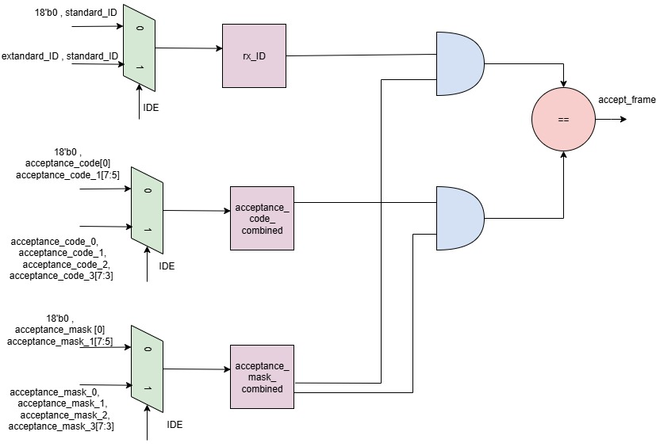
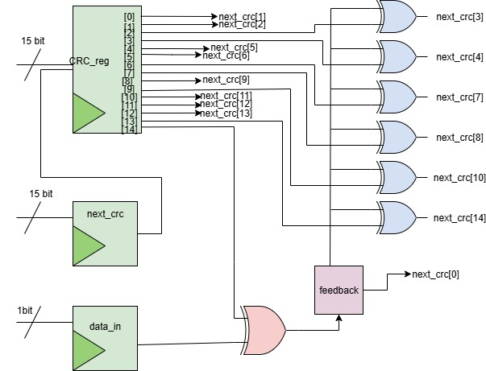

# ***CAN BUS IP CORE***
### ***OVERVIEW***

- ***Project*** : CAN BUS IP CORE
- ***Target*** : SoC Integration
- ***Protocol Supported*** :  CAN 2.0A / 2.0B
- ***Language*** : SystemVerilog
#### ***What is CAN Protocol?***

CAN (Controller Area Network) is a serial communication protocol originally developed by Bosch in 1986 for use in automotive systems, but now widely used in industrial, medical, and embedded systems.

The CAN Bus IP Core is designed to transmit and receive CAN frames with full support for arbitration, error handling, bit stuffing, and CRC checking. It is intended for integration into FPGA/ASIC-based SoC designs.

# ***Top Level Diagram***
 

  

### ***Sub Modules***

Each submodule below contributes to a specific stage of CAN frame transmission and reception, forming the core logic of the IP.

1. ***can_tranmitter***

2. ***can_receiver***

3. ***can_tx_priority***

4. ***can_filtering***

5. ***can_arbitration***

6. ***can_bitstuff***

7. ***can_bit de-stuff***

8. ***can_crc15_gen***

9. ***can_error_handling***

10. ***can_timing***

### ***Transmitter Module*** `(can_transmitter)`

#### ***Description***
The `can_transmitter` module handles the bit-level serialization of a CAN frame according to the CAN 2.0A/B protocol. It implements a finite state machine (FSM) that transitions through each field of the frame — from Start of Frame (SOF) to Interframe Space (IFS) — and generates a single `tx_bit` at each sample point on the CAN bus.

This module supports both ***standard (11-bit ID)*** and ***extended (29-bit ID)*** frames and includes handling for ***remote transmission requests (RTR)***, ***data fields***, ***CRC transmission***, and ***frame delimiters***.

---

#### ***Inputs***

| Name           | Direction | Width | Description |
|----------------|-----------|-------|-------------|
| `clk`          | Input     | 1     | System clock used to synchronize the transmitter FSM. |
| `rst_n`        | Input     | 1     | Active-low reset to initialize the module. |
| `sample_point` | Input     | 1     | Indicates when to sample and shift bits according to CAN timing. |
| `start_tx`     | Input     | 1     | Starts the transmission of a CAN frame. |

####  ***Data Bytes***

| Name        | Direction | Width | Description |
|-------------|-----------|-------|-------------|
| `tx_data_0` | Input     | 8     | Frame identifier and control bits (upper). |
| `tx_data_1` | Input     | 8     | Frame identifier and DLC bits (lower). |
| `tx_data_2` | Input     | 8     | Data payload byte 0. |
| `tx_data_3` | Input     | 8     | Data payload byte 1. |
| `tx_data_4` | Input     | 8     | Data payload byte 2. |
| `tx_data_5` | Input     | 8     | Data payload byte 3. |
| `tx_data_6` | Input     | 8     | Data payload byte 4. |
| `tx_data_7` | Input     | 8     | Data payload byte 5. |
| `tx_data_8` | Input     | 8     | Data payload byte 6. |
| `tx_data_9` | Input     | 8     | Data payload byte 7. |

#### ***Outputs***

| Signal             | Width     | Description |
|--------------------|-----------|-------------|
| `tx_bit`           | 1         | Serialized output bit for CAN TX line. |
| `tx_done`          | 1         | Asserted when transmission is complete. |
| `rd_tx_data_byte`  | 1         | Read-enable pulse for fetching the next data byte from memory/FIFO. |
| `arbitration_active` | 1       | Indicates arbitration phase is in progress. |

---

#### ***FSM States Summary***

| State               | Description                                          |
|---------------------|------------------------------------------------------|
| `STATE_IDLE`        | Waits for `tx_enable`                                |
| `STATE_SOF`         | Transmits Start of Frame (SOF = 0)                   |
| `STATE_ID_STD`      | Sends 11-bit standard ID                             |
| `STATE_BIT_RTR_1`   | Sends RTR bit for standard frame                     |
| `STATE_BIT_IDE`     | Sends IDE bit to distinguish standard/extended frame |
| `STATE_ID_EXT`      | Sends remaining 18 bits of extended ID               |
| `STATE_BIT_RTR_2`   | Sends RTR bit for extended frame                     |
| `STATE_BIT_R_1`     | Sends reserved bit (1st)                             |
| `STATE_BIT_R_0`     | Sends reserved bit (2nd)                             |
| `STATE_DLC`         | Sends 4-bit Data Length Code                         |
| `STATE_DATA`        | Sends the data bytes                                 |
| `STATE_CRC`         | Sends 15-bit CRC                                     |
| `STATE_CRC_DELIMIT` | Sends CRC delimiter (1)                              |
| `STATE_ACK`         | Sends recessive bit for ACK                          |
| `STATE_ACK_DELIMIT` | Sends ACK delimiter                                  |
| `STATE_EOF`         | Sends 7-bit End Of Frame                             |
| `STATE_IFS`         | Sends 3-bit Inter-frame space and sets `tx_done`     |

---

#### ***Functionality***

- Frame transmission starts when `start_tx` is asserted and `sample_point` is high.
- Bit and byte counters track field progress in each state.
- CRC must be calculated externally and provided via `tx_crc`.
- FSM resets on `rst_n`.

---

#### ***Data Path and Controller***

Here is the data serialization data path:

  

Here is the FSM for transmitter:

  

### ***Receiver Module*** `(can_receiver)`

#### ***Description***
The `can_receiver` module receives and decodes a CAN frame bit-by-bit at each sampling point (`rx_point`). It reconstructs the full frame according to the CAN 2.0A/B protocol, supporting both ***standard (11-bit ID)*** and ***extended (29-bit ID)*** formats. It outputs all parsed fields of the CAN frame, including identifiers, control bits, data, and CRC, and signals completion with `rx_done`.

---

#### ***Inputs***
| Signal Name        | Width  | Description |
|-------------------|--------|-------------|
| clk             | 1      | System clock for sequential operations. |
| rst_n           | 1      | Active-low asynchronous reset. |
| rx_bit_curr     | 1      | Current sampled bit from CAN bus. |
| sample_point    | 1      | Sample enable signal for reading CAN bus. |
| remove_stuff_bit| 1      | High when a stuffed bit should be ignored (bit de-stuffing). |

---

#### ***Outputs***
| Signal Name        | Width      | Description |
|-------------------|-----------|-------------|
| rx_data_array    | 8×8 bits  | Array storing the received data bytes (up to 8 bytes). |
| rx_done_flag     | 1         | High when the complete CAN frame is successfully received. |
| rx_id_std        | 11        | Standard ID of the received frame. |
| rx_id_ext        | 18        | Extended ID of the received frame (if IDE = 1). |
| rx_ide           | 1         | Indicates if the frame uses extended ID (1) or standard ID (0). |
| rx_dlc           | 4         | Data length code of the received frame (0–8 bytes). |
| rx_remote_req    | 1         | Indicates if the received frame is a remote request. |

---

####  ***FSM States Summary***

| State               | Description                                              |
|---------------------|----------------------------------------------------------|
| `STATE_IDLE`        | Wait for SOF (Start of Frame)                            |
| `STATE_ID_STD`      | Receive 11-bit standard ID                               |
| `STATE_BIT_RTR_1`   | Receive RTR bit (for standard ID)                        |
| `STATE_BIT_IDE`     | Receive IDE bit                                          |
| `STATE_ID_EXT`      | Receive 18-bit extended ID if `rx_ide` = 1               |
| `STATE_BIT_RTR_2`   | Receive RTR bit (for extended ID)                        |
| `STATE_BIT_R_1`     | Reserved bit (ignored)                                   |
| `STATE_BIT_R_0`     | Reserved bit (ignored)                                   |
| `STATE_DLC`         | Receive 4-bit data length code                           |
| `STATE_DATA`        | Receive actual data bytes (up to 8)                      |
| `STATE_CRC`         | Receive 15-bit CRC                                       |
| `STATE_CRC_DELIMIT` | Receive CRC delimiter (ignored)                          |
| `STATE_ACK`         | ACK slot (ignored in this module)                        |
| `STATE_ACK_DELIMIT` | ACK delimiter (ignored)                                  |
| `STATE_EOF`         | End of Frame (7 bits of recessive level)                |
| `STATE_IFS`         | Inter-frame space (3 bits)                               |

---

####  ***Functionality***

- Each `rx_bit_cuurent` is shifted into internal registers when `sample_point` is high.
- Frame fields (IDs, DLC, data, CRC) are parsed and saved.
- Data bytes are reassembled using an internal shift register.
- `rx_done_flag` indicates completion of a valid frame capture.
- No CRC or ACK validation is performed here (can be added externally).

---

####  ***Key Internal Registers***

| Register           | Purpose                                     |
|--------------------|---------------------------------------------|
| `rx_id_std_ff`     | Stores standard 11-bit ID                   |
| `rx_id_ext_ff`     | Stores 18-bit extension for extended ID     |
| `rx_data_array`    | Holds 8 bytes of received data              |
| `rx_crc_ff`        | Captures 15-bit CRC from the frame          |
| `rx_done_ff`       | Indicates reception complete                |
| `data_byte_ff`     | Internal shift register for byte assembly   |

---

#### ***FSM Diagram***

Here is the FSM for receiver:

  

### ***Bit Stuffing Module*** `(can_bit_stuff)`

#### ***Description***
The `can_bit_stuffer` module implements ***bit stuffing*** logic for a CAN (Controller Area Network) transmitter.  
Bit stuffing ensures that no more than five consecutive identical bits are sent, preserving synchronization between transmitter and receiver.

When the module detects ***five consecutive identical bits***, it automatically inserts a complementary bit (stuffed bit) into the transmitted stream.

#### ***Inputs***

| Signal         | Width | Description                                                  |
|----------------|-------|--------------------------------------------------------------|
| `clk`          | 1     | System clock                                                 |
| `rst_n`        | 1     | Active-low asynchronous reset                                |
| `bit_in`       | 1     | Input bit from transmitter logic                             |
| `sample_point` | 1     | High when bit counting and stuffing check should be performed |

#### ***Outputs***

| Signal           | Width | Description                                                   |
|------------------|-------|---------------------------------------------------------------|
| `bit_out`        | 1     | Output bit after optional stuffing                            |
| `stuff_inserted` | 1     | High for one cycle when a stuffed bit is inserted              |

#### ***Functionality***

- Keeps track of consecutive identical bits using `same_count`.
- When ***six identical bits*** in a row are detected (`same_count == 6`), the module outputs the ***complement*** of the previous bit as the stuffed bit.
- `stuff_inserted` goes high in that cycle to indicate stuffing occurred.
- Resets the counter on reset or when a different bit appears.

---

### ***Destuffing Module*** `(can_bit_destuff)`

#### ***Description***
The `can_bit_destuffer` module implements ***bit de-stuffing*** logic for a CAN receiver.  
It detects and flags stuffed bits so the higher-level receiver logic can skip them, reconstructing the original transmitted data.

#### ***Inputs***

| Signal         | Width | Description                                                  |
|----------------|-------|--------------------------------------------------------------|
| `clk`          | 1     | System clock                                                 |
| `rst_n`        | 1     | Active-low asynchronous reset                                |
| `bit_in`       | 1     | Incoming bit from the CAN bus                                |
| `sample_point` | 1     | High when bit counting and de-stuffing check should be performed |

#### ***Outputs***

| Signal        | Width | Description                                                   |
|---------------|-------|---------------------------------------------------------------|
| `bit_out`     | 1     | Output bit (same as input, skipping is handled externally)     |
| `remove_flag` | 1     | High when the current bit is a stuffed bit and should be ignored |

#### ***Functionality***

- Tracks consecutive identical bits using `same_count`.
- When ***six identical bits*** in a row are detected (`same_count == 6`), `remove_flag` is asserted.
- The actual ***removal*** of stuffed bits is handled by higher-level receiver logic, not inside this module.

---

### ***Bit Stuffing Data Path***

Here is the Datapath of bit stuffing:

  

### ***Bit De-stuffing Data Path***

Here is the Datapath of bit de-stuffing:

  

### ***Arbitration Module*** `(can_arbitration)`

#### ***Description***

The `can_arbitration` module is responsible for detecting arbitration loss in a Controller Area Network (CAN) protocol. Arbitration occurs during the ID field of a CAN frame when multiple nodes may attempt to transmit simultaneously. Arbitration loss is detected when a transmitter sends a recessive bit (`1`) but sees a dominant bit (`0`) on the bus, indicating another node with a higher priority is transmitting.

---

#### ***Inputs***

| Signal              | Width | Description                                                                 |
|---------------------|-------|-----------------------------------------------------------------------------|
| `clk`               | 1     | System clock                                                                |
| `rst_n`             | 1     | Active-low reset                                                            |
| `tx_bit`            | 1     | Bit transmitted by this node                                                |
| `rx_bit`            | 1     | Bit received from CAN bus                                                   |
| `sample_point`      | 1     | Sampling strobe for arbitration check                                       |
| `arbitration_active`| 1     | Indicates whether the controller is in the arbitration phase                 |

---

#### ***Outputs***

| Signal              | Width | Description                                                                 |
|---------------------|-------|-----------------------------------------------------------------------------|
| `arbitration_lost`  | 1     | Asserted high when node loses arbitration (Tx = recessive, Rx = dominant)   ||
---

#### ***Functionality***

This module monitors the transmitted (`tx_bit`) and received (`rx_bit`) bits during the arbitration phase. If the node transmits a recessive bit but receives a dominant bit at a `sample_point` during the active arbitration phase, the module flags this as an arbitration loss.

---

#### ***Internal Logic***

- A flip-flop `lost_ff` holds the arbitration loss state.
- At each `sample_point`, if:
  - `arbitration_active` is asserted,
  - the node transmits `1` (recessive), and
  - it receives `0` (dominant),
  then `lost_ff` is set to `1`.
- Once arbitration ends (`arbitration_active` = 0), the loss flag is cleared.

---

#### ***Arbitration Design Diagram***

  

### ***Priority Module*** `(can_tx_priority)`

#### ***Description***

The `can_tx_priority` module implements a ***priority-based CAN transmit request buffer***.  
It maintains a sorted list of pending CAN messages, always transmitting the frame with the ***lowest CAN ID*** (highest priority) first.

#### ***Key Features***
- ***Preemption Support*** — A newly arrived higher-priority frame can replace the currently transmitting frame.
- ***Automatic Buffer Reordering*** — Frames in the buffer remain sorted by priority.
- ***Write/Read Enable Control*** — Prevents data overwrites and unauthorized reads.
- ***Full and Empty Flags*** — For buffer status monitoring.

---

#### ***Inputs***

| Name       | Width  | Description                          |
|------------|--------|--------------------------------------|
| `clk`      | 1      | Clock signal                         |
| `rst`      | 1      | Asynchronous reset                   |
| `we`       | 1      | Write enable signal                  |
| `req_id`   | 11     | Requested CAN ID                     |
| `req_dlc`  | 4      | Requested Data Length Code           |
| `req_data` | 8×8    | Requested data payload bytes         |
| `re`       | 1      | Read enable (transmission complete)  |

#### ***Outputs***

| Name       | Width  | Description                          |
|------------|--------|--------------------------------------|
| `start_tx` | 1      | Indicates a frame is ready to transmit |
| `tx_id`    | 11     | Transmit CAN ID                      |
| `tx_dlc`   | 4      | Transmit Data Length Code            |
| `tx_data`  | 8×8    | Transmit payload bytes               |
| `full`     | 1      | Buffer is full                       |
| `empty`    | 1      | Buffer is empty                      |

---

#### ***Parameters***

| Parameter | Default | Description |
|-----------|---------|-------------|
| `N`       | 8       | Number of buffer slots |

---

####  ***Functionality***

##### Write Operation
- When `we` is asserted and the buffer is ***not full***, a new CAN frame is inserted.
- If the transmitter (`tx_reg`) is ***idle***, the frame goes directly to transmission.
- If the incoming frame has ***higher priority*** (lower `req_id`) than the current transmitting frame, ***preemption*** occurs:
  1. The current transmitting frame is pushed into the buffer (sorted position).
  2. The new frame becomes the active transmit frame.
- Otherwise, the frame is inserted into the buffer in sorted order.

##### ***Read Operation***
- When `re` is asserted and the buffer is ***not empty***:
  1. The next frame in the buffer (lowest CAN ID) is moved into the transmitter register.
  2. Buffer is shifted up to fill the gap.
- If buffer becomes empty after read, `tx_reg` is invalidated.

---

####  ***Status Flags***
- `full` — Asserted when `count == N`
- `empty` — Asserted when no valid transmit frame exists and buffer is empty

---

#### ***Priority Rules***
- ***Lower CAN ID → Higher Priority***
- Preemption replaces currently transmitting frame if incoming frame has lower ID.

---

#### ***Design Diagram***

  

### ***Filtering Module*** `(can_filtering)`

#### ***Description***
The `can_filtering` module implements ***CAN frame acceptance filtering*** based on the ***Acceptance Code*** and ***Acceptance Mask*** registers.  
It supports both ***Standard (11-bit)*** and ***Extended (29-bit)*** CAN identifiers, allowing the receiver to accept or reject frames before processing.

This module compares the incoming CAN ID with configured acceptance codes, using masks to selectively enable or disable bit comparisons.

---

#### ***Inputs***

| Signal                | Width | Description                                                                 |
|-----------------------|-------|-----------------------------------------------------------------------------|
| `ide`                 | 1     | Identifier Extension flag (`0` = standard 11-bit ID, `1` = extended 29-bit ID) |
| `id_std`              | 11    | Standard CAN identifier (always present, also part of extended format)     |
| `id_ext`              | 18    | Extended identifier bits (only valid when `ide = 1`)                        |
| `acceptance_code_0`   | 8     | Acceptance code register byte 0                                             |
| `acceptance_code_1`   | 8     | Acceptance code register byte 1                                             |
| `acceptance_code_2`   | 8     | Acceptance code register byte 2                                             |
| `acceptance_code_3`   | 8     | Acceptance code register byte 3                                             |
| `acceptance_mask_0`   | 8     | Acceptance mask register byte 0                                             |
| `acceptance_mask_1`   | 8     | Acceptance mask register byte 1                                             |
| `acceptance_mask_2`   | 8     | Acceptance mask register byte 2                                             |
| `acceptance_mask_3`   | 8     | Acceptance mask register byte 3                                             |

#### ***Outputs***

| Signal          | Width | Description                                                |
|-----------------|-------|------------------------------------------------------------|
| `accept_frame`  | 1     | `1` if the frame passes the acceptance filter, else `0`    |

---

#### ***Functionality***

- ***Identifier Formatting***:
  - ***Standard frame (`ide = 0`)***:
    - `rx_id` is formed by padding `id_std` with 18 leading zeros.
    - Acceptance code and mask are taken from `acceptance_code_0`, upper 3 bits of `acceptance_code_1`, and their corresponding mask bytes.
  - ***Extended frame (`ide = 1`)***:
    - `rx_id` is the concatenation of `id_std` (11 bits) and `id_ext` (18 bits) → total 29 bits.
    - Acceptance code and mask are taken from all four bytes, with the last byte using only its upper 5 bits.

#### ***Design Diagram***

  

### ***CRC Module*** `(can_crc15_gen)`

#### ***Description***

The `can_crc15_gen` module implements a ***15-bit CRC generator*** for the CAN (Controller Area Network) protocol.  
It processes incoming data bits in real time and updates the CRC register using the CAN polynomial:

\[
x^{15} + x^{14} + x^{10} + x^8 + x^7 + x^4 + x^3 + 1
\]

This polynomial is defined by the CAN 2.0A/B standard and is used for error detection in transmitted and received frames.

---

#### ***Inputs***

| Signal     | Width | Description                                                                 |
|------------|-------|-----------------------------------------------------------------------------|
| `clk`      | 1     | System clock                                                                |
| `rst_n`    | 1     | Active-low asynchronous reset                                               |
| `crc_en`   | 1     | CRC enable signal — when high, updates CRC register with the next bit        |
| `data_bit` | 1     | Serial data bit to be processed                                              |
| `crc_init` | 1     | High to reset CRC register to `0` at the start of a new frame                |

#### ***Outputs***

| Signal    | Width  | Description                                          |
|-----------|--------|------------------------------------------------------|
| `crc_out` | 15     | Current 15-bit CRC value                              |

---

#### ***Functionality***

- The CRC register (`crc_reg`) is updated ***bit-by-bit*** when `crc_en` is high.
- The `feedback` signal is generated as the XOR of the incoming `data_bit` and the MSB (`crc_reg[14]`).
- Shift and XOR operations are performed according to the ***CAN CRC-15 polynomial*** taps:
  - Feedback affects bits 10, 8, 7, 4, and 3.
  - All other bits shift down normally.
- The `crc_init` input resets the CRC register to zero at the beginning of a new frame.
- The final CRC value is available on `crc_out` and can be transmitted at the end of the frame.
#### ***Design Diagram***

  

---

### ***Error Handling Module `(can_error_handling)`***

#### ***Overview***
The `can_error_detection` module implements **fault confinement** for a CAN bus controller.  
It detects protocol violations (bit, stuff, form, ACK, and CRC errors), updates **Transmit Error Counter (TEC)** and **Receive Error Counter (REC)**  and determines the node’s error state (`error_active`, `error_passive`, `bus_off`).

#### ***Inputs***

| Signal                | Width | Description                                                   |
|------------------------|-------|---------------------------------------------------------------|
| `clk`                 | 1     | System clock                                                  |
| `rst`                 | 1     | Active-low reset                                              |
| `rx_bit`              | 1     | Bit received from CAN bus                                     |
| `tx_bit`              | 1     | Bit being transmitted by this node                            |
| `tx_active`           | 1     | High when node is actively transmitting                       |
| `sample_point`        | 1     | Indicates sampling instant for CAN bit timing                 |
| `bit_de_stuffing_ff`  | 1     | Helper signal for stuff-bit removal logic                     |
| `remove_stuff_bit`    | 1     | High when current bit should be removed as stuff bit          |
| `rx_bit_curr`         | 1     | Registered version of `rx_bit` (current cycle)                |
| `rx_bit_prev`         | 1     | Registered version of `rx_bit` (previous cycle)               |
| `in_arbitration`      | 1     | High during arbitration field (bit error exception applies)   |
| `in_ack_slot`         | 1     | High during ACK slot (bit error exception applies)            |

#### ***Outputs***

| Signal          | Width | Description                                           |
|-----------------|-------|-------------------------------------------------------|
| `stuff_error`   | 1     | High when stuff error is detected                     |
| `crc_error`     | 1     | High when CRC check fails                             |
| `form_error`    | 1     | High when form error is detected                      |
| `ack_error`     | 1     | High when acknowledgment error occurs                 |
| `tec`           | 8     | Transmit Error Counter                                |
| `rec`           | 8     | Receive Error Counter                                 |
| `error_active`  | 1     | Node is in error-active state                         |
| `error_passive` | 1     | Node is in error-passive state                        |
| `bus_off`       | 1     | Node is bus-off (disconnected from CAN network)       |

#### ***Functionality***

- **Error Detection Logic**  
  - On each `sample_point`, the module compares `tx_bit` with `rx_bit` to detect **bit errors** (except during arbitration and ACK slot).  
  - It monitors `bit_de_stuffing_ff` and `remove_stuff_bit` to detect **stuffing violations** when six identical bits appear without a stuff bit.  
  - CRC check results (`crc_rx_match`) set **CRC error** if mismatch occurs when `crc_check_done` is high.  
  - Fixed-form fields (`in_crc_delimiter`, `in_ack_delimiter`, `in_eof`) are checked for recessive bits; any dominant bit there triggers a **form error**.  
  - In the ACK slot, if the transmitter sees a recessive `rx_bit`, it sets an **ACK error**.

- **Error Counter Updates (TEC & REC)**  
  - When a transmit error is flagged, **TEC increases by 8** (capped at 255).  
  - When a receive error occurs, **REC increases by 1** (capped at 255).  
  - A run of **14 consecutive dominant bits** increments both TEC and REC by 8.  
  - **Dominant bits after error flag** increment REC by 8.  
  - Successful transmissions decrement **TEC by 1**, and successful receptions decrement **REC by 1** (not below 0).

- **Error State**  
  - If `tec < 128` and `rec < 128` → Node stays **Error Active**.  
  - If `tec ≥ 128` or `rec ≥ 128` → Node transitions to **Error Passive** (cannot actively signal errors).  
  - If `tec ≥ 255` → Node enters **Bus Off** state, meaning it is disconnected from the bus.  

---

 

