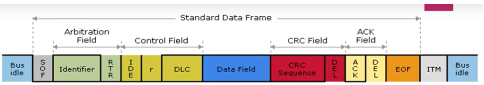
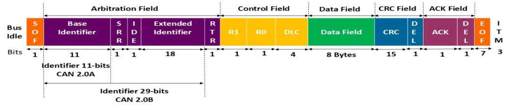

# Theory of Operation — CAN Controller

A detailed, implementation-focused explanation of Controller Area Network (CAN) core architecture, protocol, and data flow. Suitable for documentation in reports and  README files.

## 1. Overview

Controller Area Network (CAN) is a multi-master, message-oriented serial bus protocol originally developed for automotive applications (Bosch) and standardized as ISO 11898. It provides robust, prioritized, and deterministic message delivery for real-time control systems. This document explains the CAN protocol variants (2.0A/2.0B / ISO 11898-1), the core controller architecture used in hardware (FPGA/ASIC/MCU CAN IP), and the typical data flow for transmission and reception, including error handling and timing considerations

---

### Top-Level Block Diagram

  

---

## 2. Key Concepts & Terminology

- Node: Any device connected to the CAN bus (microcontroller, sensor, actuator, gateway).

- Dominant/Recessive: Logical levels on the bus — Dominant (logical '0') overrides Recessive (logical '1').

- Bitwise arbitration: Conflict resolution method where lower identifier (more dominant bits) wins.

- Frame types: Data Frame, Remote Frame, Error Frame, Overload Frame.

- Standard vs Extended frame: Standard uses 11-bit identifier (CAN 2.0A), Extended uses 29-bit identifier (CAN 2.0B).

- ACK: Acknowledge field — receivers assert a dominant bit to indicate successful reception.

- Bit stuffing: Insert a complementary bit after five consecutive identical bits to maintain synchronization.

- CRC: Cyclic Redundancy Check used for error detection (15-bit for classical CAN).

## Protocol Summary (CAN 2.0A / 2.0B & ISO 11898-1)

- Physical layer: Two-wire differential bus (CAN_H, CAN_L) implemented by a transceiver; physical termination resistors required at both ends.

- Bit rates: Common rates: 10 kbit/s — 1 Mbit/s for classical CAN (higher for CAN FD). Specific timing defined by bit time segments (SYNC, PROP, PHASE1, PHASE2).

- Message-oriented: Data carried in frames; arbitration by identifier (priority).

- Deterministic arbitration: Message with lowest numeric identifier wins arbitration.

## 4. CAN Frame Structures (classical CAN)
### 4.1 Data Frame (standard format — 11-bit ID)

  

- SOF: Start of frame (dominant bit)

- Identifier: Message ID (priority)

- RTR: Remote Transmission Request (dominant=Data frame, recessive=Remote)

- IDE: Identifier Extension bit (dominant => standard)

- DLC: Data length code (0–8)

- CRC: 15-bit CRC + CRC delimiter

- ACK: 2-bit field (ACK slot + ACK delimiter)

- EOF: End-of-frame (7 recessive bits)

### 4.2 Extended Data Frame (29-bit ID)

  

Same fields but identifier split into base ID and extended ID with IDE=1 and an extended ID field present.

### 4.3 Remote Frame

Same as Data Frame but RTR set so a node requests data for the specified ID

### 4.4 Error & Overload Frames

Error Frame: Sent by any node that detects bus errors — consists of an error flag and an error delimiter.

Overload Frame: Used to request additional delay between frames (rare in good systems).

## 5. Core CAN Controller Architecture

A typical CAN controller (hardware IP) comprises modular blocks. Below is a recommended decomposition for documentation and RTL implementation.

### 5.1 Physical Interface / Transceiver

Handles differential signalling (CAN_H / CAN_L) and converts to single-ended RX/TX logic levels.

Manages bus wake, slope control (optionally), and fail-safe.

### 5.2 Bit Timing Unit (BTU)

Generates bit clocks and sample points according to configured CAN bit timing registers (prescaler, PROP, PHASE1, PHASE2).

Produces sample_point and sample_enable signals used by the receiver logic.

### 5.3 TX Logic / Arbitration Unit

Accepts frames from CPU or DMA into a transmit queue (FIFO).

Handles arbitration: outputs TX bitstream; if node loses arbitration (reads recessive when it output dominant), it withdraws and becomes a receiver.

Handles RTR, IDE, and frame formatting including stuffing on the transmit side.

### 5.4 RX Logic / Frame Assembler

Samples bus values at sample points; performs de-stuffing and reassembly of bits into fields.

Runs CRC calculation in parallel to check integrity.

Implements acceptance filtering to decide whether to deliver frame to host (mask+filter registers or hardware filter engine).

### 5.5 CRC Unit

Implements CRC-15 (classical CAN) generator/checker used on both transmit and receive paths.

### 5.6 Error Management Unit

Tracks transmit and receive error counters (TEC, REC) and node state: Error Active, Error Passive, Bus Off as per CAN protocol.

Generates Error Frames when needed and enforces retransmissions and bus-off recovery behavior.

### 5.7 Acceptance Filter / Mailbox System

One or multiple hardware mailboxes for prioritized message buffers and hardware filters for reduced CPU load.

Supports ID masking, full ID match, range filters, or FIFO-based buffering depending on IP complexity.

### 5.8 Interface to Host (CPU / Bus)

Register map: control/status registers, mailboxes, acceptance filters, bit timing registers, error counters, interrupt flags.

Common host interfaces: APB, AHB, AXI, Wishbone, custom bus.

### 5.9 Debug & Test Support

Loopback modes (internal/external), timestamping, trace buffers, test registers, and statistics counters.

## 6. Data Flow — Transmit Path 

- `Frame creation`: CPU/DMA writes identifier, DLC, data bytes into transmit mailbox or FIFO, sets a request_to_send bit.

- `Priority selection`: If multiple mailboxes present, the TX arbiter selects the highest priority pending frame.

- `Start-of-transmission`: On bus idle, the TX logic issues SOF and starts serializing fields.

- `Arbitration`: TX unit drives each identifier bit on the bus while sampling. If a recessive bit is observed while transmitter drove dominant, that node loses arbitration and moves to listening mode — it will retry later automatically.

- `Frame stuffing & CRC`: Transmit side inserts stuff bits and appends CRC.

- `ACK handling`: After CRC delimiter, transmitter samples the ACK slot — if no node drove ACK (i.e., ACK remains recessive), transmitter marks the frame as not acknowledged (error handling).

- `Retransmission / Error handling`: On failure (e.g., no ACK, detected error), hardware automatically retries transmission up to configured attempts, while updating TEC/REC and possibly entering error passive/bus-off states.

- `Completion`: On success, TX mailbox flagged complete, interrupt raised if enabled.

## 7. Data Flow — Receive Path 

- `Bit sampling & synchronization`: BTU provides sample points; the receiver samples the bus and synchronizes on SOF.

- `De-stuffing`: Receiver removes stuff bits inserted by transmitter (counts consecutive bits and drops inserted bits).

- `Field demarcation & CRC check`: Bits are collected into identifier, control, data, CRC and CRC is checked on the fly or after reception.

- `Acceptance filter`: If the frame matches a filter, it is moved to a RX mailbox or FIFO; otherwise discarded.

- `ACK generation`: If CRC OK, receiver asserts ACK by driving dominant in the ACK slot.

- `Host notification`: RX mailbox ready flag and interrupt triggered; CPU reads data from RX mailbox.

## 8. Arbitration & Determinism

Bitwise arbitration compares transmitted bits on the bus with the node's expected bit. Dominant wins — nodes that lose arbitration cease transmitting immediately, preserving bus time and determinism.

Deterministic behavior: Priority is solely identifier-based. Lower numerical ID = higher priority.

## Error Detection & Handling (High-level)
### 9.1 Error detection mechanisms

Bit monitoring: Transmitting node monitors bus to detect if what it sent differs from actual bus state.

Bit stuffing errors: Detected if more than five identical consecutive bits appear without a stuff bit.

Format errors: Wrong fixed-format fields (e.g., wrong delimiter values).

ACK error: No receiver asserted ACK.

CRC error: CRC mismatch detected by receiver.

### 9.2 Error counters & states

Transmit Error Counter (TEC) and Receive Error Counter (REC) are incremented/decremented following specified rules.

Node states: Error Active → Error Passive → Bus Off. Bus-Off requires recovery sequence (e.g., 128 occurrences or vendor-specific behavior).

### 9.3 Retransmission

On detected transmission errors, hardware typically attempts automatic retransmission until successful or until bus-off threshold hit.

## 10. Timing Considerations & Bit Timing Configuration

- Bit time divided into: SYNC_SEG (1 Tq), PROP_SEG, PHASE_SEG1, PHASE_SEG2.

- Sample point typically around 70–80% of bit time for single-sample nodes, or triple-sampling near sample point for improved noise immunity.

- Tolerance & synchronization: Resynchronization allowed by phase segments and sample point adjustments using SJW (synchronization jump width).

- Configuration registers: prescaler, prop, phase1, phase2, SJW — must be set according to bus length, node count and bit rate to meet ISO timing constraints.

## 11. Implementation Notes for RTL / FPGA

Clocking: Use a high-frequency clock and a BTU to derive sample ticks; avoid metastability with proper synchronizers on async RX input.

FIFO Depths: Size TX/RX FIFO based on expected peak traffic and interrupt latency.

Hardware Filters: Implement simple mask+filter for low complexity; implement CAM or hash filters for higher performance.

Test modes: Provide internal loopback (no transceiver) and external loopback for validation.

Formal checks: Add assertions for frame format, FIFO overflow/underflow, error counter thresholds.